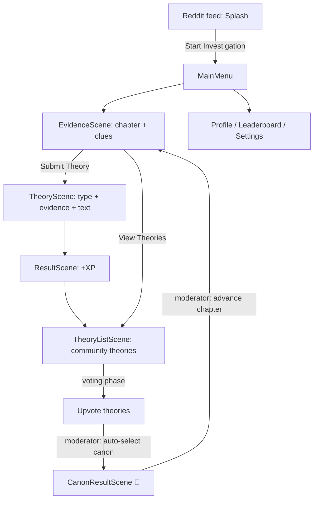
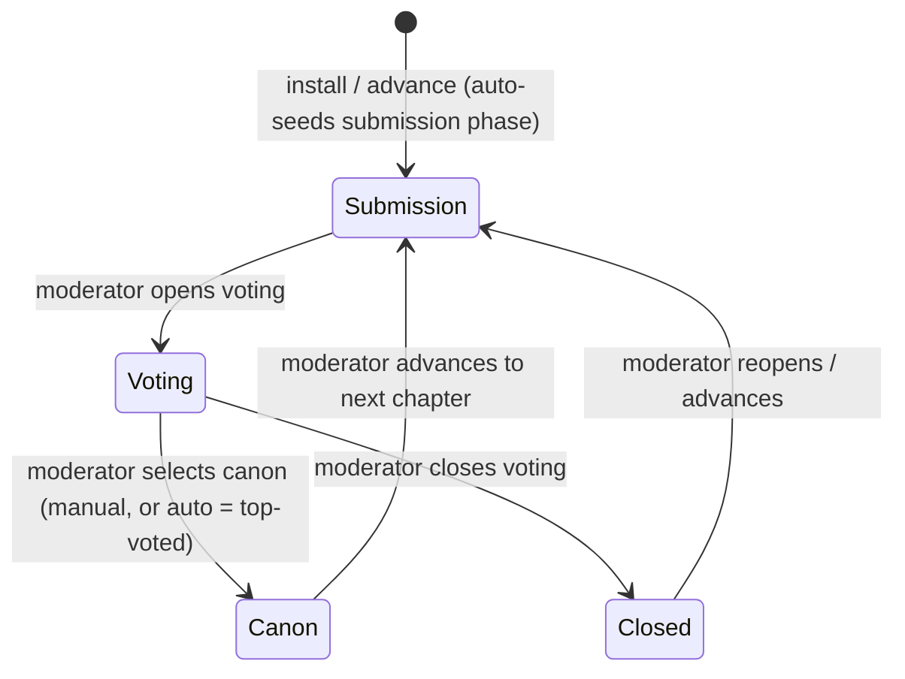
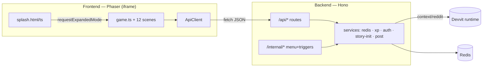
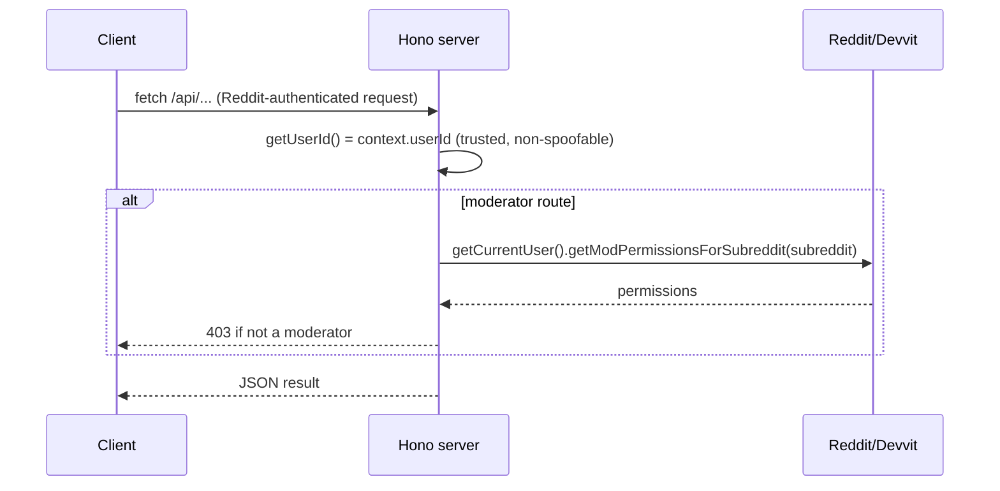

# 🔍 Mystery Agency

A collaborative, community-driven detective game built on **Reddit's Devvit** platform. Players examine evidence, submit theories about a crime, vote on the most compelling ones, and the top theory becomes **canon** — steering the story forward. Detectives earn XP, climb ranks, and unlock badges.


> **Status:** deployable — passes `type-check`, `lint`, and `build`; core loop, moderator tools, and data layer verified in code. See [Known Limitations](#-known-limitations).

---

## 📖 Table of Contents

- [Overview](#-overview)
- [Features](#-features)
- [Gameplay Flow](#-gameplay-flow)
- [Architecture](#-architecture)
- [Folder Structure](#-folder-structure)
- [Frontend Architecture](#-frontend-architecture)
- [Backend Architecture](#-backend-architecture)
- [Redis Architecture](#-redis-architecture)
- [API Documentation](#-api-documentation)
- [Authentication & Authorization](#-authentication--authorization)
- [Admin Tools](#-admin-tools)
- [Setup](#-setup)
- [Local Development](#-local-development)
- [Deployment](#-deployment)
- [Environment Variables](#-environment-variables)
- [Testing & Verification](#-testing--verification)
- [Performance Optimizations](#-performance-optimizations)
- [Troubleshooting](#-troubleshooting)
- [Known Limitations](#-known-limitations)
- [Roadmap](#-roadmap)
- [License](#-license)

---

## 🎯 Overview

Mystery Agency runs as a **Devvit Web app** inside a Reddit post. The feed shows a lightweight branded **splash** (inline view); tapping **Start Investigation** expands into the full **Phaser** game (expanded view). A **Hono** server (Node 22, serverless) backs the game over a small REST API, persisting everything in **Devvit-managed Redis**.

- **Engine:** Phaser 4 · **Language:** TypeScript · **Bundler:** Vite
- **Server:** Hono on `@devvit/web/server` · **DB:** Redis (hashes + sorted sets)
- **Identity/authz:** Reddit account via Devvit `context`; moderator checks server-side

---

## ✨ Features

**Investigation & Theories**
- Multi-chapter mysteries with typed clues (evidence / dialogue / document)
- Submit theories (≤280 chars) tagged to real evidence; four theory types (suspect / motive / method / prediction)
- Phase-based loop: **submission → voting → canon**
- Community upvoting with rank-based daily limits and duplicate/self-vote prevention
- Top theory becomes **canon** and is celebrated with a confetti screen

**Progression**
- XP for submitting (+10), voting (+2), votes received (+5), canonization (+100), daily login (+5), streak bonuses
- 6 detective ranks (Rookie → Agency Director) that gate vote/theory limits
- 5 achievement badges driven by real stats (`BADGE_META` single source of truth)
- Three leaderboards: XP, canon rate, votes received

**Community & UI**
- Podium leaderboards with current-player highlight
- Detective-themed glassmorphism UI, consistent depth/layering, real hover states
- Mobile-capable native text input, masked drag/wheel scrolling
- Moderator control panel (voting phase, canon, chapter progression, reset)

---

## 🎮 Gameplay Flow



Phases are controlled by a moderator via the Admin panel: open submissions → open voting → select canon → advance chapter (which reopens submissions on the next chapter). In-game onboarding (**How to Play** on the menu, **?** on the evidence screen) and a "What happens next?" screen after submitting keep the loop self-explanatory.

### Theory · Voting · Chapter Lifecycles



- **Theory lifecycle:** submitted (submission phase, +10 XP) → upvoted (voting phase, author +5 XP/vote) → possibly **canon** (+100 XP, shapes the chapter).
- **Voting lifecycle:** opens/closes only by moderator; rank-based daily vote limits; no self-vote, no double-vote, no voting canon theories.
- **Chapter lifecycle:** 5 embedded chapters (*The Red Fox Files* arc, ending in a predict-the-culprit finale); a moderator advances them; advancing reseeds the submission phase. Advancing past the last chapter is blocked (no dead-end).

---

## 🏗 Architecture



The Devvit-required layout `src/{client,server,shared}` maps to the layers: **Frontend** = `client`, **Backend/Devvit** = `server`, **Shared types** = `shared`.

---

## 📁 Folder Structure

```
mystery-agency/
├── src/
│   ├── client/                     # FRONTEND (Phaser, iframe)
│   │   ├── components/UIComponents.ts   # COLORS, DEPTH, buttons, cards, toast, HUD, transitions
│   │   ├── scenes/                      # 12 scenes (Boot → … → Settings)
│   │   ├── api.ts                       # typed API client (no client-side identity)
│   │   ├── game.ts / game.html / game.css     # expanded game entry (Scale.FIT)
│   │   └── splash.ts / splash.html / splash.css  # inline feed entry (branded)
│   ├── server/                     # BACKEND (Hono, serverless)
│   │   ├── routes/                      # api.ts, theories.ts, menu.ts, triggers.ts
│   │   ├── services/                    # redis, xp, auth, story-init, post (game logic)
│   │   └── index.ts                     # Hono composition + serve()
│   └── shared/                     # SHARED TYPES
│       ├── types.ts                     # domain models (type aliases)
│       └── constants.ts                 # ranks, XP, badges, BADGE_META, REDIS_KEYS
├── public/snoo.png                 # ASSETS
├── docs/                           # GAMEPLAY_GUIDE, ADMIN_GUIDE, DEPLOYMENT_GUIDE, PROJECT_ARCHITECTURE, FINAL_RELEASE_REPORT
├── tools/tsconfig.*.json           # CONFIG (project-references build)
├── devvit.json · vite.config.ts · eslint.config.js · tsconfig.json · .prettierrc
├── AGENTS.md · LICENSE · README.md
```

---

## 🖥 Frontend Architecture

- **Bootstrap** (`game.ts`): Phaser `Game` at a fixed **1024×768** design resolution, `Scale.FIT` + `CENTER_BOTH` (letterboxes cleanly on any Reddit web-view).
- **Scenes** (`scenes/`): `Boot → Preloader → MainMenu → EvidenceScene → TheoryScene → ResultScene → TheoryListScene → CanonResultScene → LeaderboardScene → ProfileScene → AdminScene → SettingsScene`. Data-driven scenes show a spinner, `await ApiClient`, then render.
- **Design system** (`components/UIComponents.ts`): `COLORS`, `DEPTH` (`CONTENT 0 · HUD 1000 · MODAL 2000 · TOAST 10000`), `PremiumButton`, `GlassCard`, `Badge`, `ToastManager`, `SceneTransitions`, `HUD`, `ScrollView` (reusable masked scroll — wheel/drag/buttons/bounds), `InfoModal` (onboarding dialog), and shared `HOW_TO_PLAY_STEPS` copy.
- **Layout integrity:** cards size to their content and text columns are bounded inside cards; long or overflowing content lives in a masked `ScrollView`, so nothing spills outside its container at any viewport.
- **Text input:** the theory editor is a **native DOM `<textarea>`** overlaid on the canvas (works with mobile keyboards; positioned from the canvas rect and re-aligned on resize).
- **Lifecycle/cleanup:** resources Phaser doesn't auto-free (DOM elements, `make.graphics` masks, DOM timers, the static HUD) are released on the Phaser **`shutdown`/`destroy` events** (the documented cleanup hook), guaranteeing no orphaned UI or leaks.

## ⚙ Backend Architecture

- **`index.ts`** composes Hono: `/api/*` (game) and `/internal/*` (Devvit menu/triggers), served on the Devvit port.
- **`routes/api.ts`** — profile, daily-login, chapter, leaderboard, and moderator-gated voting-phase / chapter-advance / set-chapter / reset.
- **`routes/theories.ts`** — list, submit, vote, and moderator-gated canon / auto-canon, with full input validation.
- **`services/` (game logic)** — `redis.ts` (typed data access), `xp.ts` (ranks/XP/badges/streaks/login), `auth.ts` (identity + mod check), `story-init.ts` (5-chapter seed/reset), `post.ts` (create post).

## 🗄 Redis Architecture

Devvit's Redis client supports **strings, hashes, and sorted sets only** (no set commands), so membership collections use sorted sets scored by timestamp.

| Key | Type | Purpose |
|-----|------|---------|
| `user:{id}` | hash | profile: xp, rank, counters, badges, login/vote dates |
| `chapter:{id}` | hash | title, content, clues (JSON), canon text |
| `story:current_chapter` | string | active chapter id |
| `theory:{id}` | hash | theory record |
| `theories:chapter:{id}` | zset | theory ids for a chapter (score = createdAt) |
| `theories:canon` · `theories:trending` | zset | canon ids · trending by votes |
| `votes:theory:{id}` | zset | voter ids (dedupe via `zScore`) |
| `voting:active` · `voting:phase` · `voting:ends_at` | string | phase state |
| `leaderboard:xp` · `leaderboard:canon_rate` · `leaderboard:votes_received` | zset | rankings |

---

## 🔌 API Documentation

Base path `/api`. Identity comes from Devvit `context.userId` (never a request body/header).

| Method | Route | Purpose | Auth |
|--------|-------|---------|------|
| GET  | `/api/profile` | Get/auto-create profile; award once-per-day login XP | Authenticated |
| POST | `/api/daily-login` | Claim daily bonus (idempotent per day) | Authenticated |
| GET  | `/api/chapter` | Current chapter (self-heals if uninitialized) | Authenticated |
| GET  | `/api/leaderboard?type=xp\|canon_rate\|votes_received` | Rankings | Authenticated |
| GET  | `/api/admin/status` | Caller's moderator status + live phase/chapter (drives admin UI) | Authenticated |
| GET  | `/api/theories` | Theories for current chapter + voting phase | Authenticated |
| POST | `/api/theories` | Submit a validated theory | Authenticated |
| POST | `/api/theories/:id/vote` | Upvote a theory | Authenticated |
| POST | `/api/theories/:id/canon` | Mark a theory canon | **Moderator** |
| POST | `/api/theories/auto-canon` | Canonize the top-voted theory | **Moderator** |
| POST | `/api/voting-phase` | Set `submission`/`voting`/`closed` | **Moderator** |
| POST | `/api/chapter/advance` | Advance to the next chapter | **Moderator** |
| POST | `/api/set-chapter` | Jump to a specific chapter | **Moderator** |
| POST | `/api/admin/reset` | Reset story to chapter 1 | **Moderator** |

Internal (Devvit): `POST /internal/menu/post-create`, `POST /internal/triggers/on-app-install`.

---

## 🔐 Authentication & Authorization



- **Identity:** always `context.userId`. The client sends no identity — nothing to spoof.
- **Authorization:** every admin/mutation route calls `isModerator()` (`src/server/services/auth.ts`); non-mods get `403`. The client reveals the **🛠️ ADMIN** button only after `GET /api/admin/status` confirms real moderator status.

---

## 🛠 Admin Tools

Real subreddit moderators automatically see a **🛠️ ADMIN** button (top-right of the Main Menu) — the client checks `GET /api/admin/status`. The panel shows a **live status line** (current chapter + phase) and the recommended flow, and offers (all server-enforced): **Open Submissions / Open Voting / Close Voting**, **Auto-Select Canon**, **Advance Chapter**, **Reset Game** (in-scene confirm). Feedback uses in-scene toasts (no blocked `alert/confirm`). See [`docs/ADMIN_GUIDE.md`](docs/ADMIN_GUIDE.md).

---

## 🚀 Setup

**Prerequisites:** Node.js ≥ 22.2.0, a Reddit account with Developer access, and the Devvit CLI (installed via dependencies).

```bash
git clone <repository-url>
cd mystery-agency
npm install
npm run login        # authenticate the Devvit CLI with Reddit
```

Set your dev subreddit in `devvit.json` (`dev.subreddit`).

## 💻 Local Development

```bash
npm run dev          # devvit playtest on your dev subreddit (live reload)
npm run type-check   # tsc --build (project references)
npm run lint         # eslint src
npm run build        # vite build → dist/client + dist/server
npm run prettier     # format
```

Workflow: edit → `npm run dev` (playtest in-subreddit) → `type-check`/`lint` → iterate.

## 📦 Deployment

```bash
npm run deploy       # type-check && lint && devvit upload
npm run launch       # deploy && devvit publish  (submits for review)
```

`deploy` gates on a clean `type-check` and `lint` before uploading. `launch` additionally publishes for Reddit review. The `onAppInstall` trigger seeds the story (chapters + submission phase) on first install.

## 🔧 Environment Variables

**None required.** Devvit manages configuration through `devvit.json` (entrypoints, menu, triggers, dev subreddit). A local `.env` is git-ignored and not needed to run the app.

---

## 🧪 Testing & Verification

Current verification is via the toolchain plus evidence-based code review (see `docs/`):

| Check | Command | Result |
|-------|---------|--------|
| Type-check | `npm run type-check` | ✅ 0 errors |
| Lint | `npm run lint` | ✅ 0 errors |
| Build | `npm run build` | ✅ success (client + server) |
| Debug logging | `grep -rn console.log src` | ✅ 0 |

> There is **no automated test suite yet** (see Roadmap). Behavior is validated by the gates above and by tracing the loop against the code (`docs/FINAL_RELEASE_REPORT.md`).

## ⚡ Performance Optimizations

- **Fixed-resolution `Scale.FIT`** — one design space, no per-scene responsive recomputation.
- **Sorted-set membership** — O(log n) dedupe/ordering instead of scans.
- **Event-based scene teardown** — DOM elements, masks, timers, and the HUD are freed deterministically; Phaser plugins auto-free tweens/timers/input/display objects.
- **Masked, container-based scrolling** — one container per row moved as a unit; off-screen rows clipped.
- **Lean bundle** — no debug logging; dead components/scenes/assets removed.

## 🐞 Troubleshooting

| Symptom | Fix |
|---|---|
| `npm run deploy` fails at lint | Run `npm run lint`; the script is `eslint src` (cross-platform on Windows `cmd.exe`). |
| Admin actions return 403 | You must be a **moderator** of the subreddit; enforcement is server-side. |
| No chapter loads | `GET /api/chapter` self-heals via `initializeStory`; otherwise confirm the app installed (trigger seeds data). |
| Theory submission "closed" | A moderator must set the phase to **submission** (Admin → Open Submissions). |
| Voting disabled | Phase must be **voting** (Admin → Open Voting); you can't vote for your own or an already-canon theory. |
| Text input not visible on mobile | It's a native `<textarea>` positioned over the canvas; tap it to focus and raise the keyboard. |

## ⚠ Known Limitations

- **No automated tests** — validated by type-check/lint/build + code tracing.
- **Non-atomic writes** — vote/submit use sequential Redis calls (no `watch`/multi transaction); safe under normal load, but not hardened for high contention.
- **No rate limiting** on public routes.
- **Phase transitions are manual** (moderator-driven); there is no automatic timer-based progression yet.
- **Audio toggles are cosmetic** — Settings persists preferences but no sound system exists yet.

## 🗺 Roadmap

- [ ] Automated test suite (vitest) for `xp.ts` and route validation
- [ ] Atomic vote/submit via Redis `watch`/multi
- [ ] Rate limiting on public routes
- [ ] Scheduler-driven automatic phase transitions
- [ ] More chapters and story branching on canon choices
- [ ] Real audio for the Settings toggles
- [ ] Real-time notifications on canon selection

---

## ✅ Production Checklist

- [x] `type-check`, `lint`, `build` pass (0 errors); deploy gate green
- [x] No debug logging, dead code, dead scenes, or unused assets
- [x] Server-trusted identity + moderator-gated admin routes
- [x] Redis uses supported structures (hashes + sorted sets); story self-seeds on install
- [x] No orphaned UI / DOM elements / listener leaks (event-wired cleanup)
- [x] Layout integrity (contained cards + masked scrolling); consistent depth/hover
- [x] In-game onboarding + "what happens next" clarity
- [ ] Live Devvit playtest confirmed (needs `npm run login`)
- [ ] Automated test suite · atomic writes · rate limiting

**Completion ~95% · Production readiness 90/100 · Critical issues 0.** Full evidence in [`docs/FINAL_RELEASE_REPORT.md`](docs/FINAL_RELEASE_REPORT.md).

## 📜 License

BSD-3-Clause — see [LICENSE](LICENSE).

**Built for Reddit's Devvit platform.**
