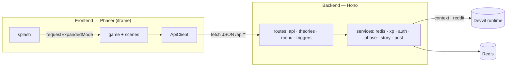

# 🔍 Mystery Agency

A collaborative detective game for Reddit, built on the **Devvit** platform. Players examine evidence, submit theories about a crime, vote on the most convincing ones, and the community's top pick becomes **canon** — steering a ten-chapter mystery. Detectives earn XP, climb ranks, and unlock badges along the way.


---

## Table of Contents

- [Overview](#overview)
- [Features](#features)
- [Gameplay](#gameplay)
- [Architecture](#architecture)
- [Folder Structure](#folder-structure)
- [Tech Stack](#tech-stack)
- [Installation](#installation)
- [Environment Variables](#environment-variables)
- [Development](#development)
- [Deployment](#deployment)
- [Admin Guide](#admin-guide)
- [API Overview](#api-overview)
- [Privacy](#privacy)
- [Terms](#terms)
- [License](#license)

---

## Overview

Mystery Agency runs as a **Devvit Web app** inside a Reddit post. The feed shows a lightweight branded splash; tapping **Start Investigation** expands into the full **Phaser** game. A **Hono** server backs the game over a small REST API, with all state persisted in **Devvit-managed Redis**.

The game is designed to run itself: phases progress automatically on a 12-hour schedule, while subreddit moderators keep full manual control when they want it.

For a deeper walkthrough of the story, mechanics, and moderator tools, see **[GAME_OVERVIEW.md](GAME_OVERVIEW.md)**.

## Features

- **Collaborative mysteries** — read evidence, submit theories, and vote as a community across a **10-chapter campaign**.
- **One theory per chapter** — each player commits a single theory per chapter, keeping voting focused and fair.
- **Community canon** — the top-voted theory becomes canon and drives the next chapter.
- **Hybrid phase engine** — automatic 12-hour progression (submission → voting → canon → next chapter) with full moderator override (pause / resume / skip / manual).
- **Progression** — XP, six detective ranks, five achievement badges, and three leaderboards (XP, Canon, Votes).
- **Clarity** — live phase + countdown banners, phase-change notifications, and a chapter badge on every theory.
- **Polished UI** — a detective-themed design system with responsive layouts for desktop, mobile, and the Reddit iframe.

## Gameplay

1. **Investigate** the chapter's evidence and clues.
2. **Submit** one theory (type + text + tagged evidence).
3. **Vote** when the voting phase opens (auto every 12h, or moderator-triggered).
4. The **top-voted theory becomes canon** and shapes the next chapter.
5. Repeat across all ten chapters to the finale.

XP is earned for submitting, voting, receiving votes, and canonization; ranks unlock higher limits; badges reward milestones. Full details in **[GAME_OVERVIEW.md](GAME_OVERVIEW.md)**.

## Architecture



- **Frontend** (`src/client`) — Phaser scenes + a shared UI component system; talks to the server only via `fetch('/api/...')`.
- **Backend** (`src/server`) — a Hono app with `routes/` (HTTP transport, incl. Devvit menu/trigger endpoints) and `services/` (game logic: Redis access, XP/ranks/badges, auth, phase engine, story).
- **Shared** (`src/shared`) — domain types and constants used by both sides.
- **Data** — Redis hashes for users/chapters/theories and sorted sets for memberships and leaderboards (Devvit's Redis has no set commands, so memberships are timestamp-scored sorted sets).

## Folder Structure

```
mystery-agency/
├── src/
│   ├── client/                     # Frontend (Phaser)
│   │   ├── components/UIComponents.ts   # design system (buttons, cards, badges, toast, HUD, scroll, modal)
│   │   ├── scenes/                      # Boot, Preloader, MainMenu, Evidence, Theory, Result,
│   │   │                                # TheoryList, CanonResult, Leaderboard, Profile, Admin, Settings
│   │   ├── phase.ts                     # phase formatting + notifications + chapter helpers
│   │   ├── api.ts                       # typed API client
│   │   ├── game.* / splash.*            # expanded game + inline feed entrypoints
│   ├── server/                     # Backend (Hono)
│   │   ├── routes/                      # api.ts, theories.ts, menu.ts, triggers.ts
│   │   ├── services/                    # redis, xp, auth, phase, story-init, post
│   │   └── index.ts                     # Hono composition + serve()
│   └── shared/                     # Shared types & constants
├── public/                         # static assets (snoo.png)
├── tools/                          # TypeScript project-reference configs
├── devvit.json · vite.config.ts · eslint.config.js · tsconfig.json
├── README.md · GAME_OVERVIEW.md · privacy.md · terms.md · LICENSE
```

## Tech Stack

- **Engine:** Phaser 4 · **Language:** TypeScript · **Bundler:** Vite
- **Server:** Hono on `@devvit/web/server` (Node 22 serverless)
- **Database:** Reddit Devvit-managed Redis
- **Platform:** Reddit Developer Platform (Devvit)

## Installation

Prerequisites: **Node.js ≥ 22.2.0**, a Reddit account with Developer access, and moderator access to a subreddit for testing.

```bash
git clone <repository-url>
cd mystery-agency
npm install
npm run login        # authenticate the Devvit CLI with Reddit
```

Set your development subreddit in `devvit.json` (`dev.subreddit`) — use a subreddit you moderate so the Admin panel is available.

## Environment Variables

**None required.** Devvit manages all configuration through `devvit.json` (entrypoints, menu, triggers, dev subreddit). A local `.env` is git-ignored and not needed to run the app.

## Development

```bash
npm run dev          # devvit playtest on your dev subreddit (live reload)
npm run type-check   # tsc --build (project references)
npm run lint         # eslint src
npm run build        # vite build → dist/client + dist/server
npm run prettier     # format
```

**Conventions:** TypeScript is `strict` (no implicit `any`, no unused locals); prefer `type` aliases and named exports; the game uses Devvit-web APIs only (`navigateTo` / `requestExpandedMode` on the client, `context` / `reddit` / `redis` on the server) — no `window.alert`/`confirm` inside the iframe.

## Deployment

```bash
npm run deploy       # type-check && lint && devvit upload
npm run launch       # deploy && devvit publish  (submit for Reddit review)
```

On install, the `onAppInstall` trigger seeds the story (chapters + opening submission phase). Moderators create a game post from the subreddit menu ("Create a new Mystery Agency post"). After Reddit review, the app can be installed on any subreddit from the Developer portal.

## Admin Guide

Moderators of the host subreddit automatically see a **🛠️ ADMIN** button on the Main Menu (moderator status is verified server-side). The panel shows the live chapter/phase/countdown and provides:

- **Manual override** — Open Submissions / Open Voting / Close Voting.
- **Automation** — Pause / Resume the 12-hour auto-progression, Skip Phase, Auto-Select Canon.
- **Chapter & game** — Advance Chapter, Reset Game.

Phases auto-advance every 12 hours by default; moderator actions override the schedule and automation resumes from the phase you set. See **[GAME_OVERVIEW.md](GAME_OVERVIEW.md#moderator-guide)**.

## API Overview

Base path `/api`. Identity comes from Devvit's request `context.userId` — the client never sends a user id. Moderator-only routes are enforced server-side (403 otherwise).

| Method | Route | Purpose | Access |
|--------|-------|---------|--------|
| GET | `/api/profile` | Player profile (auto-creates; once/day login XP) | Authenticated |
| POST | `/api/daily-login` | Claim daily bonus | Authenticated |
| GET | `/api/chapter` | Current chapter | Authenticated |
| GET | `/api/theories` | Theories for the current chapter + phase + submitted flag | Authenticated |
| POST | `/api/theories` | Submit a theory (one per chapter) | Authenticated |
| POST | `/api/theories/:id/vote` | Vote for a theory | Authenticated |
| GET | `/api/leaderboard?type=xp\|canon_rate\|votes_received` | Rankings | Authenticated |
| GET | `/api/admin/status` | Moderator status + live phase/chapter | Authenticated |
| POST | `/api/theories/:id/canon` · `/api/theories/auto-canon` | Set canon | Moderator |
| POST | `/api/voting-phase` · `/api/phase/auto` · `/api/phase/skip` | Phase control | Moderator |
| POST | `/api/chapter/advance` · `/api/set-chapter` · `/api/admin/reset` | Chapter / reset | Moderator |

## Privacy

The game stores only Reddit-account-linked gameplay data (username, XP, rank, badges, theories, votes) in Devvit-managed Redis. No emails, passwords, payment data, or third-party tracking. See **[privacy.md](privacy.md)**.

> For the Devvit App Directory, publish `privacy.md` and `terms.md` as public URLs (e.g. via GitHub Pages) and add them to your app listing.

## Terms

Fair-play rules and usage terms are in **[terms.md](terms.md)**. By playing you agree not to cheat, spam, or abuse the game, and to follow Reddit's content policy.

## 🎥 Demo Video

Full gameplay demo here:

https://www.reddit.com/user/mystery-agency

## 🎮 Live App - Comming Soon

https://developers.reddit.com/apps/mystery-agency

## Demo Video 

https://youtu.be/1CAu0JruiqY

## License

BSD-3-Clause — see [LICENSE](LICENSE).

---

_Built for Reddit's Devvit platform._
