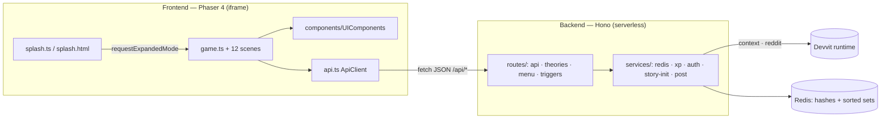

# Mystery Agency — Project Architecture

Production architecture of the game as it stands in `src/`. Reflects the current, verified structure.

---

## 1. System overview



## 2. Layer separation

| Layer | Location | Responsibility |
|---|---|---|
| **Frontend** | `src/client/scenes`, `src/client/components` | Phaser scenes + UI component system |
| **Client services** | `src/client/api.ts` | typed HTTP client to the backend |
| **Backend / API** | `src/server/routes` | HTTP routes (`/api` game + `/internal` Devvit) |
| **Services / game logic** | `src/server/services` | Redis access, XP/ranks/badges, auth, story, posts |
| **Devvit / Reddit integration** | `routes/menu.ts`, `routes/triggers.ts`, `services/post.ts`, `services/auth.ts`, `devvit.json` | menu, install trigger, post creation, mod/identity |
| **Shared types & constants** | `src/shared` | domain types, ranks, XP, badges, Redis keys |
| **Assets** | `public/` | `snoo.png` (splash) |
| **Config** | `devvit.json`, `vite.config.ts`, `tools/tsconfig.*`, `eslint.config.js` | build/deploy/lint |
| **Docs** | `README.md` + `docs/` | product + ops documentation |

> Devvit requires the app to build to `dist/client` + `dist/server`, so the `src/{client,server,shared}` split is the platform-idiomatic layout. Within the backend, game logic lives in `services/` and transport in `routes/`.

## 3. Folder structure

```
src/
├── client/                      # FRONTEND
│   ├── components/UIComponents.ts    # COLORS, DEPTH, PremiumButton, GlassCard, Badge,
│   │                                 # ToastManager, HUD, ScrollView, InfoModal, transitions
│   ├── scenes/                       # Boot, Preloader, MainMenu, Evidence, Theory, Result,
│   │                                 # TheoryList, CanonResult, Leaderboard, Profile, Admin, Settings
│   ├── api.ts                        # typed ApiClient
│   ├── game.ts / game.html / game.css        # expanded game entry (Scale.FIT)
│   └── splash.ts / splash.html / splash.css  # inline feed entry
├── server/                      # BACKEND
│   ├── routes/                       # api.ts, theories.ts, menu.ts, triggers.ts
│   ├── services/                     # redis.ts, xp.ts, auth.ts, story-init.ts, post.ts
│   └── index.ts                      # Hono composition + serve()
└── shared/                      # SHARED
    ├── types.ts                      # domain models
    └── constants.ts                  # ranks, XP, badges, BADGE_META, REDIS_KEYS
```

## 4. Scene map (Frontend)

`Boot → Preloader → MainMenu → { EvidenceScene → TheoryScene → ResultScene → TheoryListScene → CanonResultScene, LeaderboardScene, ProfileScene, AdminScene, SettingsScene }`

- **Component system:** one `PremiumButton`, `GlassCard`, `ScrollView` (masked, wheel/drag/buttons), `InfoModal`, `ToastManager`, `HUD`; centralized `DEPTH` (CONTENT/HUD/MODAL/TOAST).
- **Lifecycle:** DOM elements, scroll masks, timers, and the HUD singleton are freed on the Phaser `shutdown`/`destroy` events (the documented hook); Phaser plugins auto-free tweens/timers/input/display objects.

## 5. Data flow

**Reads:** `/api/profile` (auto-create + once/day login XP), `/api/chapter` (self-heals), `/api/leaderboard`, `/api/theories`, `/api/admin/status` (mod + live phase/chapter).
**Writes:** `/api/theories` (validated submit), `/api/theories/:id/vote` (economy + caps).
**Moderator:** `/api/voting-phase`, `/api/theories/:id/canon`, `/api/theories/auto-canon`, `/api/chapter/advance`, `/api/set-chapter`, `/api/admin/reset`.

## 6. Redis schema (sorted-set based)

| Key | Type | Purpose |
|---|---|---|
| `user:{id}` | hash | profile (xp, rank, counters, badges, dates) |
| `chapter:{id}` | hash | title, content, clues (JSON), canon |
| `story:current_chapter` | string | active chapter |
| `theory:{id}` | hash | theory record |
| `theories:chapter:{id}` | zset | theory ids for a chapter |
| `theories:canon` / `theories:trending` | zset | canon / trending |
| `votes:theory:{id}` | zset | voter ids (dedupe via `zScore`) |
| `voting:{active,phase,ends_at}` | string | phase state |
| `leaderboard:{xp,canon_rate,votes_received}` | zset | rankings |

Devvit's Redis client has no set commands, so membership is modelled as timestamp-scored sorted sets.

## 7. Authentication & authorization

- **Identity:** `context.userId` (Devvit, non-spoofable). The client sends no identity.
- **Authorization:** moderator routes call `isModerator()` (`getModPermissionsForSubreddit`) → 403 for non-mods. The client reveals admin UI only after `GET /api/admin/status` confirms real mod status.

## 8. Build & config

- **Vite + `@devvit/start`** builds client and server into `dist/`.
- **TypeScript project references** (`tools/tsconfig.*`) with strict settings (`noUnusedLocals`, `noUncheckedIndexedAccess`, no explicit `any`).
- **ESLint flat config** (`eslint src`), Prettier.

## 9. Content

Story content is embedded in `services/story-init.ts` as *The Red Fox Files* (5 chapters, 4 clues each), seeded on install and by `resetStory()`. No runtime filesystem dependency.
